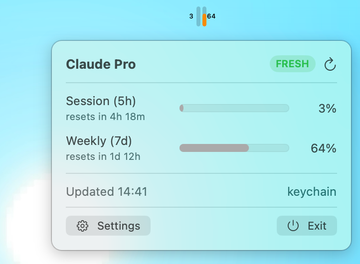

# Claude Tray Monitor

A native macOS menu-bar app that shows your Claude rate limits at a glance —
two slim vertical bars with your current usage, refreshed on a gentle,
configurable schedule.

<p align="center">
  
</p>

Inspired by [_usage-monitor-for-claude_](https://github.com/jens-duttke/usage-monitor-for-claude)
(Windows) and informed by the API/credential logic of the author's VS Code
extension _claude-context-monitor_.

## Features

- **Two vertical bars** in the menu bar (session + weekly by default) with
  optional percentage labels — compact, color-coded, easy to read at a glance.
- **Color-coded limits**: green / orange (warning) / red (error), with
  configurable thresholds.
- **Follows macOS light/dark theme** automatically — or pin it to light/dark
  in Settings (a feature the original Windows app does not have).
- **Configurable polling interval: 1–60 minutes** via a slider in the UI.
  One network request per interval, no more.
- **Left-click popover**: all detected quota windows (Session, Weekly, Sonnet,
  Opus, Fable, and any new ones Anthropic adds) with reset countdowns, plan
  label, and stale-data indicator.
- **Right-click menu**: Check Now, Settings…, Quit.
- **Zero configuration**: uses your existing Claude Code login. On macOS the
  OAuth token is read from the Keychain (`Claude Code-credentials`), with the
  `~/.claude/.credentials.json` file as a fallback for custom config dirs.
- **Low memory footprint**: native AppKit, no Electron, no webviews, no
  runtime. Idles around 40 MB RSS; SwiftUI is only loaded when the popover or
  settings window is open.

## Requirements

- macOS 14 (Sonoma) or later
- A logged-in Claude Code (any flavor: CLI, VS Code, Claude Desktop)

## Install

Download the latest `ClaudeTrayMonitor-macos.zip` from
[Releases](https://github.com/yumedzi/claude-tray-monitor/releases), unzip, and
move `Claude Tray Monitor.app` to your Applications folder. The release is
ad-hoc signed; on first launch you may need to right-click the app and choose
**Open** (or run `xattr -dr com.apple.quarantine "Claude Tray Monitor.app"`).
To remove, simply delete the app.

## Build from source

```sh
make bundle        # builds release binary and assembles the .app
open "build/Claude Tray Monitor.app"   # or double-click it
make run           # run in place with `swift run`
make release       # produce build/ClaudeTrayMonitor-macos.zip
```

## How it works

The app polls `https://api.anthropic.com/api/oauth/usage` and
`/api/oauth/profile` — the same endpoints Claude Code uses — with your existing
OAuth credentials. It never asks for an API key.

If the currently stored token is rejected (e.g. revoked by an account switch),
the app automatically tries the other stored credential slots on your Mac
(per-project and account-swap entries) and uses the first one that
authenticates, so monitoring keeps following your active Claude account.

## Security

- **Single network destination**: `api.anthropic.com` only.
- **Credentials stay local**: the token is used only in HTTP `Authorization`
  headers, never logged, never stored in app settings, never sent elsewhere.
- **No files written**: settings live in standard `UserDefaults`; no secrets
  are persisted by the app. Launch-at-Login uses `SMAppService`.
- **No obfuscation**: small, readable modules; your token never appears in the
  UI or tooltips.

## License

[MIT](LICENSE). Independent, community-built project — not created, endorsed,
or officially supported by Anthropic. "Claude" and "Anthropic" are trademarks
of Anthropic, PBC, used here solely to indicate compatibility.